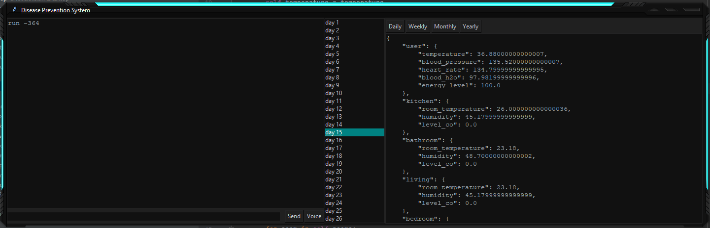
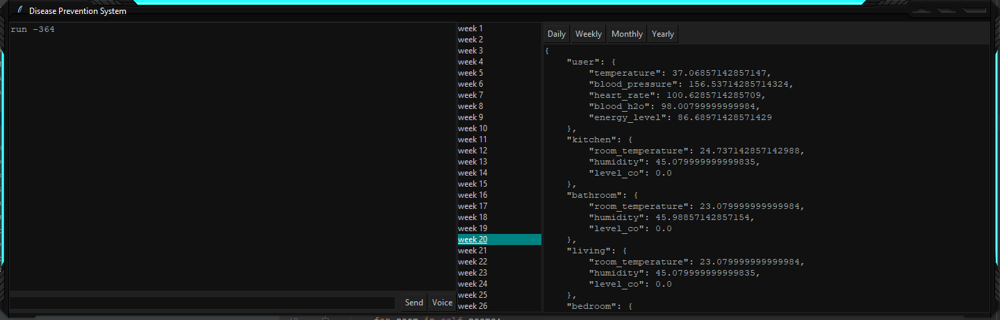

# HOME ASSISTANT

## Instalation

⦁	Extract the archive inside a folder.

⦁	Open a cmd window inside the same folder.

⦁	Run the command “pip install pipwin” and then “pipwin install pyaudio” to install PyAudio.

⦁	Run the command “pip install SpeechRecognition”.

⦁	Run the command “pip install pyttsx3”.

⦁	Run main.py 

## Setup

⦁	To use the application, first, simulate a number of days using the command “run -*no_of_days*”.

⦁	To generate a report for a specific period of time, click on one of the “Daily”, “Weekly”, “Monthly” or “Yearly” buttons and then, from the list, choose the day, week, month or year by clicking on it.  

⦁	“cls” command will clear the command window 

⦁	“reset” command will erase all simulated data

⦁	To send the commands press “Enter” on the keyboard

⦁	Use the “Voice” button to send commands using the microphone

## Testing

### Daily

###### Weekly

###### Monthly

###### Yearly

